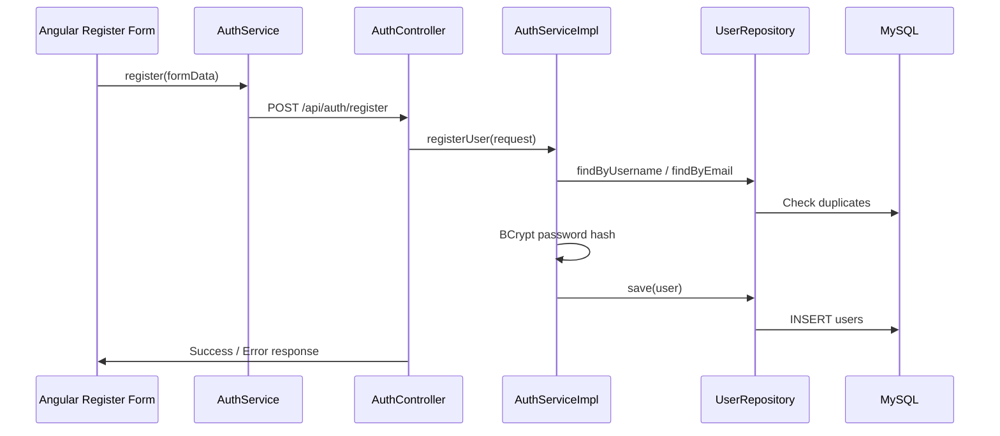
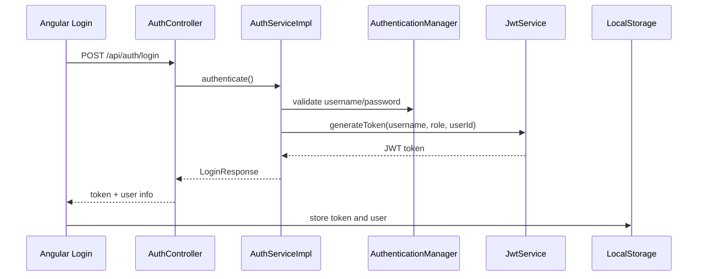
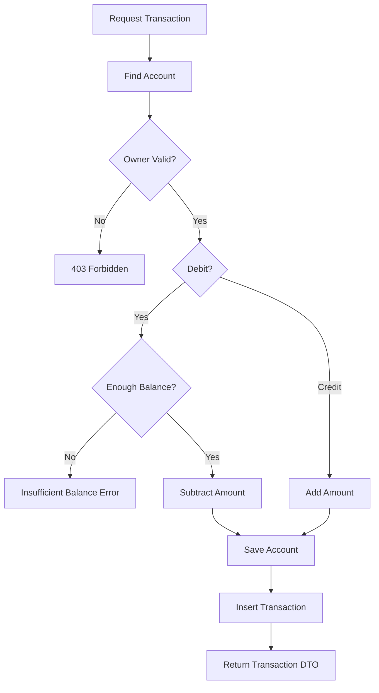

# Sprint 1 Work Explanation

This document explains the Day 2 to Day 9 implementation work for NeoBank360. It is written in an interview-ready format and is based on the actual current backend and frontend implementation.

## Important Note

The original day-wise plan mentions a few items that differ slightly from the current project implementation:

- JWT is stored in `localStorage`, not `sessionStorage`.
- Registration is handled by `AuthServiceImpl.registerUser()`, not `UserService.register()`.
- User account data is fetched through `/api/user/accounts`.
- Account opening has a separate KYC/account-opening flow.

So, during an interview, explain the actual implementation confidently.

## Day 2: User Onboarding

### Backend: User Registration

The onboarding work started with the `User` JPA entity.

The `User` entity represents application users in the database and is mapped using:

```java
@Entity
@Table(name = "users")
```

Important fields include:

- `id`
- `username`
- `email`
- `passwordHash`
- `fullName`
- `mobileNumber`
- `role`
- `isActive`
- `isApproved`

Primary key generation is handled with:

```java
@Id
@GeneratedValue(strategy = GenerationType.IDENTITY)
```

Unique constraints are used for identity fields:

```java
@Column(nullable = false, unique = true)
private String username;

@Column(nullable = false, unique = true)
private String email;
```

This prevents duplicate users at the database level.

The repository is:

```java
UserRepository extends JpaRepository<User, Long>
```

This gives built-in CRUD methods:

- `save()`
- `findById()`
- `findAll()`
- `delete()`

Custom lookup methods were added:

```java
Optional<User> findByUsername(String username);
Optional<User> findByEmail(String email);
Optional<User> findByAadhaarNumber(String aadhaarNumber);
```

These methods are used for login, duplicate email checking, and KYC Aadhaar validation.

Registration logic is inside:

```java
AuthServiceImpl.registerUser()
```

The registration flow is:

```text
RegisterRequest
-> check username/email already exists
-> encode password using BCrypt
-> create User entity
-> save user
```

The password is never stored directly. It is stored as a BCrypt hash:

```java
passwordEncoder.encode(request.getPassword())
```

This is important because even if the database is exposed, raw passwords are not visible.

The controller endpoint is:

```http
POST /api/auth/register
```

This endpoint is implemented in:

```java
AuthController.register()
```

### Frontend: Registration

The frontend connects to registration using:

```ts
AuthService.register()
```

It sends an HTTP POST request to:

```ts
http://localhost:8080/api/auth/register
```

The frontend registration form validates data before sending it to the backend. It checks:

- required fields
- valid email format
- password rules
- confirm password match, if present

The frontend prevents bad input early, while the backend still validates and protects the database.

### Registration Flow



## Day 3: Security Implementation

### Backend: Login And JWT

The login endpoint is:

```http
POST /api/auth/login
```

It is implemented in:

```java
AuthController.login()
```

The frontend login page calls:

```ts
LoginComponent.onSubmit()
```

Inside this method, Angular calls:

```ts
this.authService.login(this.loginForm.value)
```

That sends a request to:

```ts
POST http://localhost:8080/api/auth/login
```

The backend receives a:

```java
LoginRequest
```

Then:

```java
AuthServiceImpl.authenticate()
```

performs the login logic.

The login flow is:

```text
username/password received
-> AuthenticationManager validates credentials
-> CustomUserDetailsService loads user from database
-> JwtService generates token
-> LoginResponse returns token and user details
```

The important backend method is:

```java
authenticationManager.authenticate(...)
```

This validates the password using Spring Security.

Then:

```java
userDetailsService.loadUserByUsername(request.getUsername())
```

loads the user from the database.

Then:

```java
jwtService.generateToken(username, role, userId)
```

generates a JWT with these claims:

- username as subject
- role
- userId
- issued date
- expiry date

The token is signed using HS512:

```java
.signWith(getSigningKey(), SignatureAlgorithm.HS512)
```

### Frontend: Login UI And Token Storage

Frontend stores the returned token using:

```ts
localStorage.setItem('token', token)
```

It also stores user information:

```ts
localStorage.setItem('user', JSON.stringify(user))
```

After login, the user is redirected based on role:

```ts
if (response.role === 'ADMIN') {
  this.router.navigate(['/admin']);
} else {
  this.router.navigate(['/user']);
}
```

So the login response controls whether the user goes to the admin dashboard or user dashboard.

### JWT Login Flow



### JWT Authentication Filter

The backend uses:

```java
JwtAuthenticationFilter
```

This filter runs before protected API requests.

It checks the request header:

```text
Authorization: Bearer <token>
```

If the token is valid, it extracts:

- username
- role

Then it creates:

```java
UsernamePasswordAuthenticationToken
```

and stores it in:

```java
SecurityContextHolder
```

That means the backend knows who is calling the API.

### Frontend Auth Interceptor

Frontend uses:

```ts
AuthInterceptor
```

This automatically attaches JWT to every request:

```ts
headers: req.headers.set('Authorization', `Bearer ${token}`)
```

This is important because the token does not need to be manually added in every service method. The interceptor centralizes authentication headers.

## Day 4: Access Control

### Backend: RBAC

Role-based access control was added using:

```java
@EnableMethodSecurity
```

inside:

```java
SecurityConfig
```

This enables method-level security such as:

```java
@PreAuthorize("hasRole('ADMIN')")
```

This is used on admin APIs and loan admin operations.

The JWT contains the user role:

```java
claims.put("role", role);
```

Inside `JwtAuthenticationFilter`, the role is converted into:

```java
new SimpleGrantedAuthority("ROLE_" + role)
```

If the token contains:

```text
role = ADMIN
```

Spring Security sees:

```text
ROLE_ADMIN
```

That is why:

```java
hasRole('ADMIN')
```

works.

Security rules are configured in `SecurityConfig`:

```java
.requestMatchers("/api/auth/login", "/api/auth/register").permitAll()
.requestMatchers("/api/admin/**").hasRole("ADMIN")
.requestMatchers("/api/user/**").hasRole("USER")
.anyRequest().authenticated()
```

Meaning:

- login/register are public
- admin APIs require admin role
- user APIs require user role
- all other APIs require authentication

### Frontend: Guards And Role-Based UI

Frontend route guards include:

```ts
AuthGuard
AdminGuard
```

The guard checks whether the user is logged in and whether the role matches the route.

The frontend also conditionally displays UI based on role. For example, after login:

```ts
if (response.role === 'ADMIN') {
  navigate('/admin')
}
```

### Business Reason

A normal customer must not access:

- admin dashboard
- approval screens
- loan decision screens
- user management
- audit logs

RBAC protects banking operations from unauthorized access.

## Day 6: Account Module

The account module represents bank accounts owned by users.

The backend entity is:

```java
Account
```

Important fields:

- `id`
- `user`
- `accountNumber`
- `accountType`
- `balance`
- `isActive`

Relationship:

```java
@ManyToOne
@JoinColumn(name = "user_id")
private User user;
```

This means one user can have multiple accounts.

Repository:

```java
AccountRepository extends JpaRepository<Account, Long>
```

Important methods include:

```java
findByUser(User user)
findByAccountNumber(String accountNumber)
```

Account service:

```java
AccountServiceImpl
```

Important methods:

```java
createAccountForUser(Long userId, String accountType)
getAccountsForUser(Long userId)
getAccountById(Long accountId)
saveTransaction(...)
```

Account number is generated automatically:

```java
"NB" + random number
```

In the current implementation, user accounts are fetched from:

```http
GET /api/user/accounts
```

Controller:

```java
AccountController.getAccounts()
```

Important security idea:

The frontend does not send userId in the request body.

Instead, the backend uses:

```java
securityUtils.getCurrentUser()
```

This reads the authenticated user from the JWT security context.

That is more secure because users cannot fake another userId.

### Account Fetch Flow

```text
Angular user dashboard
-> BankingService.getUserAccounts()
-> GET /api/user/accounts
-> JwtAuthenticationFilter validates token
-> SecurityUtils gets logged-in user
-> AccountServiceImpl.getAccountsForUser(userId)
-> AccountRepository.findByUser()
-> return account DTOs
```

## Day 7: Transaction Engine

Transactions are stored in:

```java
Transaction
```

Important fields:

- `account`
- `transactionType`
- `amount`
- `description`
- `category`
- `balanceAfter`
- `transactionDate`
- `referenceNumber`

The most important field is:

```java
balanceAfter
```

### Why `balanceAfter` Is Important

It stores the account balance at the exact moment of transaction.

Example:

```text
Before: Rs 10,000
Debit: Rs 2,000
balanceAfter: Rs 8,000
```

Even if the account balance changes later, old transaction records remain auditable.

Transaction saving logic is inside:

```java
AccountServiceImpl.saveTransaction()
```

The transaction flow is:

```text
Find account
-> check transaction type
-> if DEBIT, check balance is enough
-> calculate new balance
-> save updated account
-> create transaction record
-> save transaction
```

Important overdraft check:

```java
if DEBIT and balance < amount:
    throw BadRequestException("Insufficient balance")
```

The method is transactional:

```java
@Transactional
```

### Why `@Transactional` Is Important

Account balance update and transaction insert must happen together.

If the transaction insert fails, the balance update should not remain alone.

This protects financial consistency.

### Transaction Flow Diagram



## Days 8 And 9: Frontend Dashboard And Transaction UI

The user dashboard is mainly implemented in:

```text
user.component.ts
user.component.html
user.component.css
```

When the user dashboard loads:

```ts
ngOnInit()
```

calls:

```ts
loadUserData()
```

This loads:

- accounts
- transactions
- budgets
- bills
- rewards
- notifications
- charts

The account list displays:

- account number
- account type
- balance
- recent activity

Frontend service used:

```ts
BankingService
```

It calls backend APIs using `HttpClient`.

The auth interceptor automatically adds JWT, so backend knows which user is logged in.

### Transaction UI

The transaction UI displays:

- date
- type
- amount
- description
- category
- balance after

Credit/debit color coding is done using Angular/CSS:

- CREDIT is green
- DEBIT is red

Business reason:

Users can quickly understand money coming in vs money going out.

The dashboard also builds spending charts using Chart.js.

Important methods:

```ts
initChart()
updateChart()
initBudgetChart()
updateDashboardChartTheme()
```

These methods prepare chart data from transaction and budget data.

Example:

```text
Transactions grouped by category
-> category total calculated
-> Chart.js doughnut chart rendered
```

Theme support is handled with:

```ts
ThemeService
```

and Angular signals/effects:

```ts
effect(() => {
  this.isDarkMode = this.themeService.isDarkMode();
  this.updateDashboardChartTheme();
});
```

So when dark mode changes, charts also update colors.

## How Backend Connects With Frontend

The connection is through REST APIs.

### Login Flow

```text
Angular LoginComponent
-> AuthService.login()
-> POST /api/auth/login
-> AuthController.login()
-> AuthServiceImpl.authenticate()
-> JwtService.generateToken()
-> LoginResponse
-> Angular stores token
```

### User Account Flow

```text
Angular UserComponent
-> BankingService.getUserAccounts()
-> AuthInterceptor adds JWT
-> GET /api/user/accounts
-> JwtAuthenticationFilter validates token
-> AccountController
-> AccountServiceImpl
-> AccountRepository
-> MySQL
-> DTO response
-> Angular displays accounts
```

### Transaction Flow

```text
Angular form submit
-> BankingService API call
-> backend validates ownership and balance
-> @Transactional updates account and inserts transaction
-> frontend refreshes account and chart
```

## Why These Technical Decisions Were Used

### JWT

JWT is used because the app is stateless. The backend does not need to store sessions. Every request carries token identity.

### Interceptor

The Angular interceptor is used because token attachment is required for many APIs. Instead of adding headers manually everywhere, one interceptor handles all authenticated requests.

### DTO Pattern

DTOs are used to avoid exposing entity internals like password hashes and database relationships.

### SecurityUtils

`SecurityUtils` is used to get the logged-in user from the backend security context. This prevents trusting userId from the frontend.

### `@Transactional`

`@Transactional` is used for financial operations where multiple database changes must succeed or fail together.

### `balanceAfter`

`balanceAfter` is used for auditability. It gives historical proof of account balance after every transaction.

### BCrypt

BCrypt is used because passwords must be one-way hashed, not encrypted or stored as plain text.

### RBAC

RBAC is used because admin and customer actions must be separated in a banking system.

## Business Value

### User Onboarding

Allows secure customer registration.

### JWT Login

Gives secure access without server-side session storage.

### RBAC

Protects admin operations like approvals and loan decisions.

### Account Module

Lets each user view only their own banking data.

### Transaction Engine

Maintains accurate balance and audit trail.

### Frontend Dashboard

Gives users a clear picture of balance, spending, and activity.

### Charts

Help users understand spending patterns visually.

## Interview Explanation

You can say:

> I implemented user onboarding by creating a User entity, repository, DTOs, registration API, and Angular registration/login flow. Passwords are hashed using BCrypt before saving. After login, the backend generates a JWT containing the userId and role. Angular stores this token and sends it automatically through an HTTP interceptor. On every protected request, the backend JWT filter validates the token and populates Spring SecurityContext. From there, controllers use SecurityUtils to identify the logged-in user instead of trusting userId from the request body.

For the account module, you can say:

> I implemented accounts with a one-to-many relationship between User and Account. The backend always derives the user from the JWT, so users can only fetch their own accounts. Transactions are handled inside a transactional method that updates account balance and inserts a transaction record together. I also store balanceAfter as an immutable snapshot for audit purposes.

## Interview Questions To Practice

### Day 2

1. Why did you create a separate `User` entity?
2. Why should email and username be unique?
3. Why do we hash passwords?
4. Why use BCrypt instead of plain SHA?
5. Why use DTOs for registration?
6. What happens if duplicate email is submitted?
7. How does Angular send registration data to Spring Boot?

### Day 3

1. Explain the complete login flow.
2. What does JWT contain in your project?
3. Where is JWT stored in frontend?
4. How does `JwtAuthenticationFilter` work?
5. What is `SecurityContextHolder`?
6. Why is the app stateless?
7. What does `AuthInterceptor` do?

### Day 4

1. What is RBAC?
2. Difference between authentication and authorization?
3. Why use `@PreAuthorize`?
4. How is role extracted from JWT?
5. What happens if a USER calls ADMIN API?
6. How does Angular guard protect routes?
7. Why should backend security exist even if frontend hides admin buttons?

### Day 6

1. Explain the Account entity.
2. How is account linked with user?
3. Why should backend get userId from token?
4. How do you prevent one user from seeing another user's account?
5. How is account number generated?
6. What is the role of `AccountRepository`?
7. What does `GET /api/user/accounts` do?

### Day 7

1. Explain transaction processing.
2. Why use `@Transactional`?
3. How do you prevent overdraft?
4. Why store `balanceAfter`?
5. What happens if transaction save fails after balance update?
6. Difference between CREDIT and DEBIT?
7. Why is transaction history important in banking?

### Days 8 And 9

1. How does Angular dashboard load account data?
2. What is the role of `BankingService`?
3. How does the frontend refresh balance after transaction?
4. How do you color CREDIT/DEBIT transactions?
5. How do charts get transaction data?
6. How does dark mode update charts?
7. How does the interceptor reduce repeated code?

## Best Answer To Remember

> The strongest part of my implementation is that the frontend never decides the authenticated user. Angular only sends the JWT. The backend validates it, extracts identity and role, and then performs ownership checks before returning or modifying banking data.
