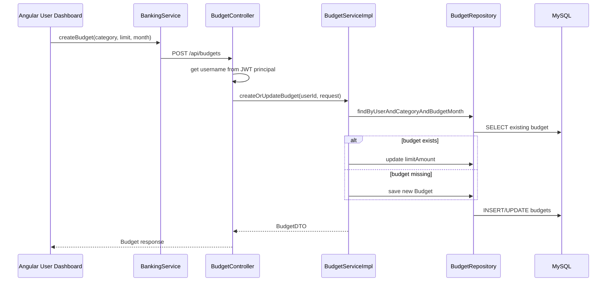
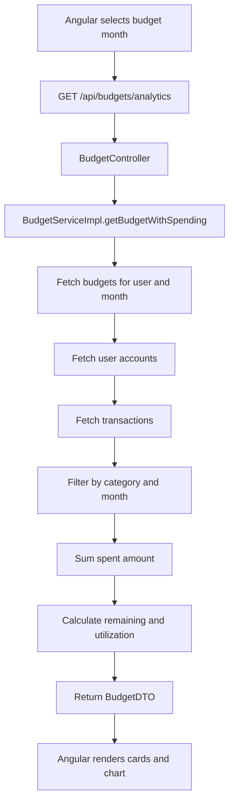
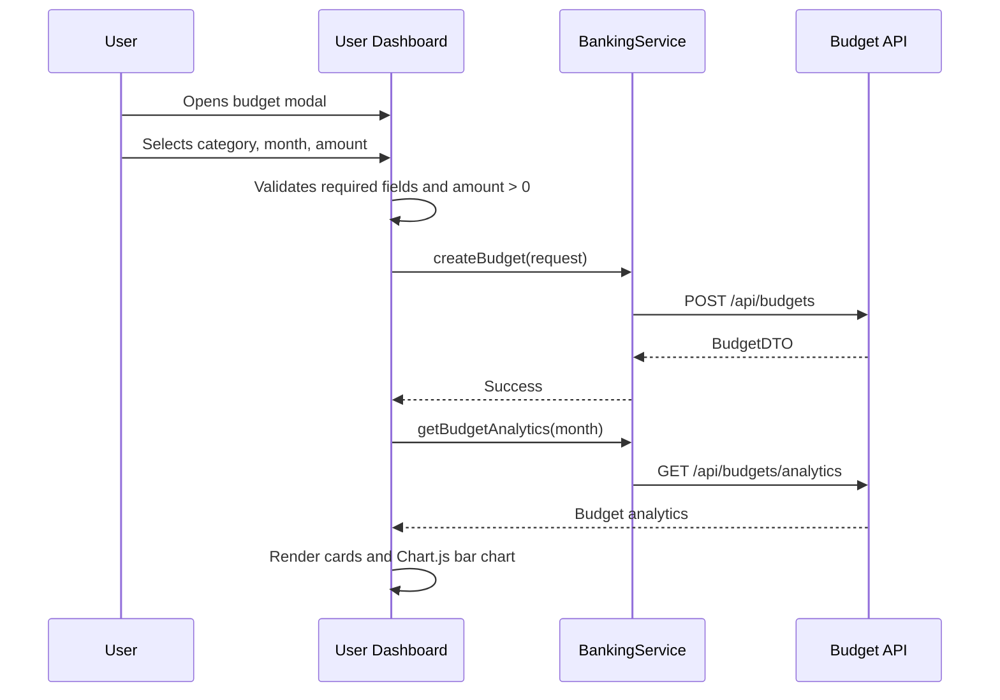
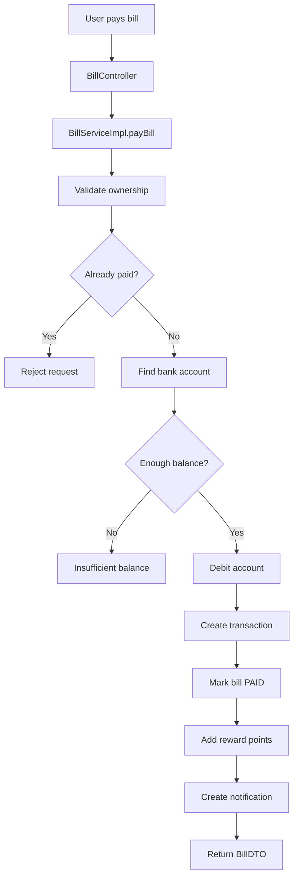
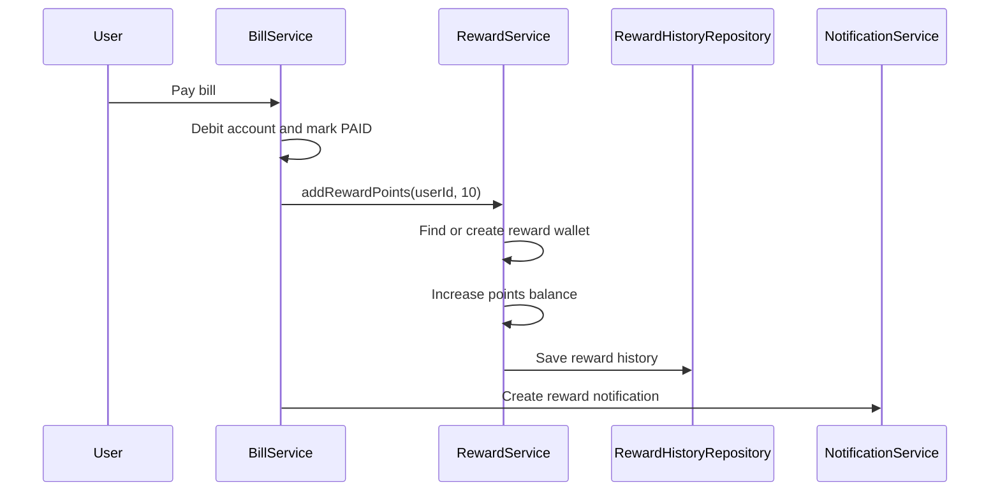
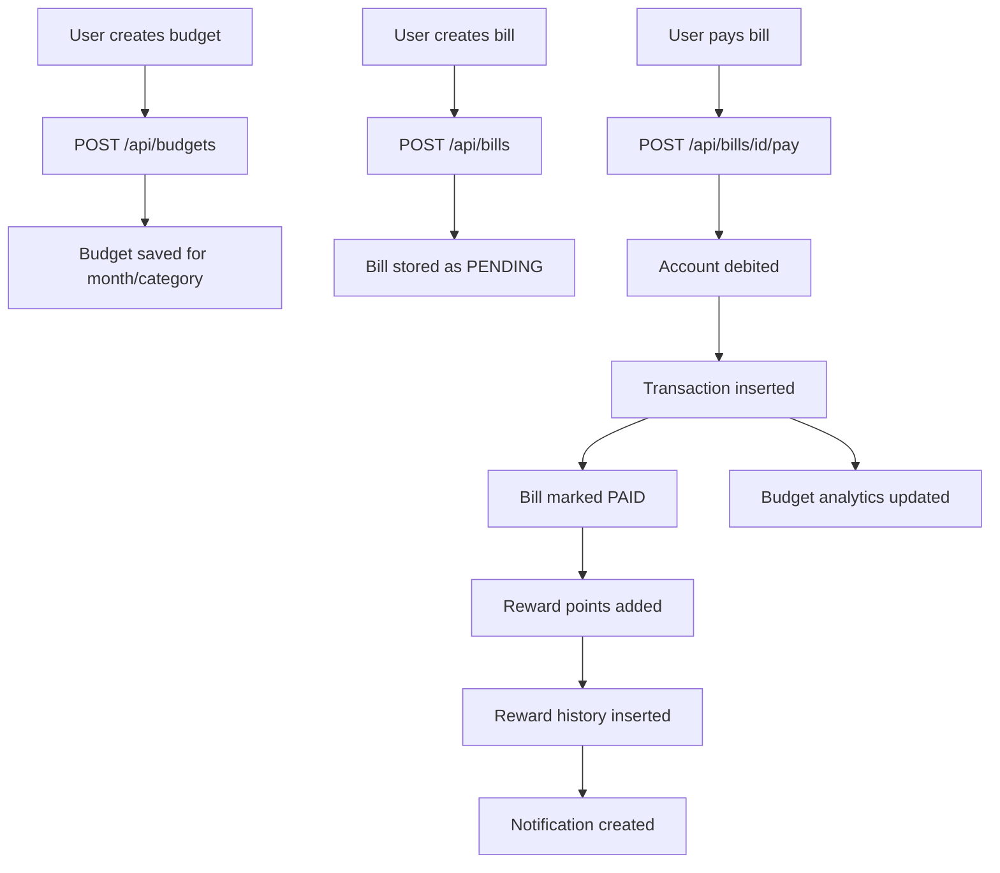

# Sprint 2 Work Explanation

This document explains the Day 12 to Day 17 implementation work for NeoBank360. It focuses on the Budget Creation Engine, Budget Tracking, Bills Management, Rewards System, and the related Angular UI.

The explanation is written in an interview-ready format and is based on the current actual implementation.

## Important Note

The original sprint plan says:

- `POST /api/budgets`
- `GET /api/budgets/{userId}/{month}`
- separate Angular components like `budget/create`, `budget/dashboard`, `bills/list`, `bills/create`, `rewards/dashboard`

In the current project:

- Budget APIs exist under `/api/budgets`.
- Bill APIs exist under `/api/bills`.
- Some duplicate convenience APIs also exist under `/api/user`.
- The user-facing Budget, Bills, and Rewards UI is mainly implemented inside the main user dashboard:

```text
Neobank-frontend/src/app/pages/user/user.component.ts
Neobank-frontend/src/app/pages/user/user.component.html
Neobank-frontend/src/app/pages/user/user.component.css
```

So, in an interview, explain the actual implementation:

> I implemented Budget, Bills, and Rewards as integrated modules inside the user dashboard instead of separate pages, while keeping the backend APIs modular through dedicated controllers and services.

## Day 12: Budget Creation Engine

## Session 1: Backend Budget Creation

The Budget module starts with the `Budget` JPA entity.

The entity is mapped using:

```java
@Entity
@Table(name = "budgets")
```

Important fields:

- `id`
- `user`
- `category`
- `limitAmount`
- `budgetMonth`
- `createdAt`

The user relationship is:

```java
@ManyToOne
@JoinColumn(name = "user_id", nullable = false)
private User user;
```

This means one user can create many budgets.

The budget month is stored as:

```java
private YearMonth budgetMonth;
```

This is useful because budgets are monthly, not daily.

The repository is:

```java
BudgetRepository extends JpaRepository<Budget, Long>
```

Important repository methods include:

```java
findByUserAndCategoryAndBudgetMonth(...)
findByUserAndBudgetMonth(...)
findByUser(...)
```

These methods allow the backend to:

- find all budgets for a user
- find budgets for a specific month
- find whether a budget already exists for the same user, category, and month

## Budget Creation Service

Budget creation is handled in:

```java
BudgetServiceImpl.createOrUpdateBudget()
```

The current implementation behaves as an upsert:

```text
If budget exists for same user + category + month
-> update limit amount

If budget does not exist
-> create new budget
```

Flow:

```text
Get user by userId
-> parse budgetMonth as YearMonth
-> find existing budget by user + category + month
-> if exists, update it
-> if missing, create a new Budget
-> set limitAmount
-> save budget
-> return BudgetDTO
```

Important code idea:

```java
Budget budget = budgetRepository
    .findByUserAndCategoryAndBudgetMonth(user, request.getCategory(), month)
    .orElseGet(() -> Budget.builder()
        .user(user)
        .category(request.getCategory())
        .budgetMonth(month)
        .build());
```

This avoids duplicate budgets for the same category/month by reusing the existing record.

## Budget Controller

The dedicated budget controller is:

```java
BudgetController
```

Endpoint:

```http
POST /api/budgets
```

Method:

```java
createBudget()
```

The controller extracts the authenticated username using:

```java
@AuthenticationPrincipal String username
```

Then it finds the user:

```java
userRepository.findByUsername(username)
```

Then it calls:

```java
budgetService.createOrUpdateBudget(user.getId(), request)
```

This is important because the frontend does not send `userId`. The backend gets the user from the JWT-authenticated principal.

## Session 2: Backend Validation

The DTO used for creating budgets is:

```java
BudgetRequest
```

Important validation annotations:

```java
@NotBlank(message = "Category is required")
private String category;

@NotNull(message = "Limit amount is required")
@Positive(message = "Limit must be positive")
private BigDecimal limitAmount;

@NotBlank(message = "Budget month is required")
private String budgetMonth;
```

Validation rules:

- category is required
- limit amount must be positive
- budget month is required

If validation fails, Spring validation sends HTTP 400 through global exception handling.

### Difference From Original Plan

The original plan said duplicate budget should return HTTP 409.

The current implementation updates the existing budget instead of failing.

That is actually useful from a user experience point of view:

> If the user creates a budget for the same category/month again, the system treats it as an update instead of forcing the user to delete and recreate it.

## Budget Creation Flow



## Day 13: Budget Summary And Tracking

## Session 1: Backend Budget Analytics

Budget analytics are handled by:

```java
BudgetServiceImpl.getBudgetWithSpending()
```

The API endpoint is:

```http
GET /api/budgets/analytics?month=YYYY-MM
```

The frontend calls it using:

```ts
getBudgetAnalytics(month: string)
```

The backend parses the month:

```java
YearMonth yearMonth = YearMonth.parse(month);
```

This expects the format:

```text
YYYY-MM
```

Example:

```text
2026-06
```

The service fetches all budgets for the authenticated user and selected month:

```java
budgetRepository.findByUserAndBudgetMonth(user, yearMonth)
```

Then it calculates:

- total budget
- total spent
- remaining amount
- utilization percentage
- per-category budget summary

## Spending Calculation

For each budget category, the service calls:

```java
calculateSpendingForCategory(user, category, yearMonth)
```

This method:

1. Calculates month start date.
2. Calculates next month start date.
3. Fetches accounts owned by the user.
4. Fetches transactions from those accounts.
5. Filters transactions by category.
6. Filters transactions within the same month.
7. Sums the transaction amount.

Important date logic:

```java
LocalDateTime start = month.atDay(1).atStartOfDay();
LocalDateTime end = month.plusMonths(1).atDay(1).atStartOfDay();
```

The filter checks:

```java
transactionDate >= start
transactionDate < end
```

This correctly includes all transactions in the selected month.

## Utilization Formula

Utilization is calculated as:

```text
utilization = totalSpent / totalBudget * 100
```

In code:

```java
double utilization = totalBudget.doubleValue() > 0
    ? totalSpent.doubleValue() / totalBudget.doubleValue() * 100
    : 0;
```

Remaining amount:

```java
remaining = totalBudget - totalSpent
```

The current implementation prevents negative remaining in DTO output:

```java
remaining.max(BigDecimal.ZERO)
```

So if spending exceeds budget, remaining displays as zero, while utilization shows the overuse.

## Session 2: Category Mapping

In the current implementation, budget tracking is based mainly on transaction category matching:

```java
budget.getCategory().equalsIgnoreCase(transaction.getCategory())
```

The category mapping is handled by:

```java
PaymentCategoryUtil.normalizeBillCategory()
```

This maps bill and payment types into budget categories.

Examples:

```text
Electricity, Water, Gas/LPG -> Bill Payment
Broadband, Mobile, DTH -> Recharge Payment
Credit Card -> Card Payment
Loan EMI, EMI -> EMI Payment
Insurance -> Insurance Payment
Metro, Bus, Train -> Travel Payment
```

This is important because bill payments automatically become part of budget analytics.

Example:

If the user pays an electricity bill:

```text
Bill type = ELECTRICITY
Mapped category = Bill Payment
Transaction category = Bill Payment
Budget category = Bill Payment
```

Then the budget dashboard can count that payment under Bill Payment spending.

## Budget Analytics Flow



## Day 14: Budgeting UI

## Session 1: Budget Creation Form

In the current frontend, budget creation is implemented inside:

```text
user.component.ts
user.component.html
```

Important state variables:

```ts
budgetCategory = '';
budgetLimit = '';
selectedBudgetMonth = new Date().toISOString().slice(0, 7);
showBudgetModal = false;
budgetError = '';
budgetSuccess = '';
```

The form collects:

- category
- budget month
- limit amount

Budget categories are shared with bills and EMI transactions:

```ts
budgetCategories = [
  'Bill Payment',
  'Recharge Payment',
  'Card Payment',
  'EMI Payment',
  'Insurance Payment',
  'Travel Payment',
  'Transfer',
  'Shopping',
  'Subscription',
  'Other',
];
```

The budget modal is opened using:

```ts
openBudgetModal()
```

Budget creation is handled by:

```ts
createBudget()
```

Frontend validation:

```ts
if (!this.budgetCategory || !this.budgetLimit) {
  this.budgetError = 'Please fill all fields';
  return;
}

if (limit <= 0) {
  this.budgetError = 'Limit amount must be greater than 0';
  return;
}
```

Then the request is built:

```ts
const request = {
  category: this.budgetCategory,
  limitAmount: limit,
  budgetMonth: this.selectedBudgetMonth,
};
```

Then Angular calls:

```ts
this.bankingService.createBudget(request)
```

which sends:

```http
POST /api/budgets
```

On success:

```ts
this.budgetSuccess = 'Budget created successfully!';
this.closeBudgetModal();
this.loadBudgets();
```

So the UI refreshes the budget list immediately.

## Session 2: Budget Dashboard

Budget data is loaded with:

```ts
loadBudgets()
```

Then analytics are loaded:

```ts
loadBudgetAnalytics()
```

This calls:

```ts
this.bankingService.getBudgetAnalytics(this.selectedBudgetMonth)
```

The dashboard displays:

- budget category
- limit amount
- spent amount
- remaining amount
- utilization percentage

The budget chart is created using Chart.js:

```ts
initBudgetChart()
```

The chart compares:

- Budget
- Spent

Important chart datasets:

```ts
{
  label: 'Budget',
  data: budgetAmounts
}

{
  label: 'Spent',
  data: spentAmounts
}
```

This helps the user visually compare planned spending vs actual spending.

## Budget UI Flow



## Day 15: Bill Management Engine

## Session 1: Backend Bill Creation

The bill module starts with the `Bill` JPA entity.

Important fields:

- `id`
- `user`
- `account`
- `billerName`
- `billerAccountNumber`
- `billType`
- `category`
- `amount`
- `dueDate`
- `status`
- `description`
- `createdAt`
- `paidAt`

The bill status is an enum:

```java
BillStatus
```

Common statuses:

```text
PENDING
PAID
```

Bill creation is handled by:

```java
BillServiceImpl.createBill()
```

Flow:

```text
Find user
-> find user's primary account
-> normalize category using PaymentCategoryUtil
-> create Bill entity
-> status = PENDING
-> save bill
-> return BillDTO
```

Important category normalization:

```java
String budgetCategory = PaymentCategoryUtil.normalizeBillCategory(request.getCategory());
```

This connects bill management with budget management.

Endpoint:

```http
POST /api/bills
```

Controller:

```java
BillController.createBill()
```

The controller uses:

```java
@AuthenticationPrincipal String username
```

to find the logged-in user.

## Session 2: Status Updates And Payment

Bill payment is handled by:

```java
BillServiceImpl.payBill()
```

Flow:

```text
Find user
-> find bill
-> validate bill belongs to user
-> reject if already PAID
-> find user's account
-> check balance is enough
-> subtract amount
-> save account
-> create DEBIT transaction
-> mark bill PAID
-> set paidAt
-> save bill
-> add reward points
-> create reward notification
```

Important ownership check:

```java
if (!bill.getUser().getId().equals(user.getId())) {
    throw new BadRequestException("Bill does not belong to user");
}
```

Important duplicate-payment check:

```java
if (bill.getStatus() == BillStatus.PAID) {
    throw new BadRequestException("Bill has already been paid");
}
```

Important balance check:

```java
if (account.getBalance().compareTo(bill.getAmount()) < 0) {
    throw new BadRequestException("Insufficient balance to pay bill");
}
```

The method is transactional:

```java
@Transactional
```

This is important because the account debit, transaction insert, bill status update, reward, and notification should stay consistent.

## Bill Transaction Creation

When a bill is paid, the backend creates a transaction:

```java
Transaction.builder()
    .account(account)
    .transactionType(TransactionType.DEBIT)
    .amount(bill.getAmount())
    .description("Bill payment: " + bill.getBillerName())
    .category(PaymentCategoryUtil.normalizeBillCategory(bill.getCategory()))
    .balanceAfter(account.getBalance())
    .referenceNumber("BILL" + System.currentTimeMillis())
    .build()
```

This is important because bill payment becomes part of:

- transaction history
- spending overview
- budget utilization
- recent transactions

## Reminder Flag

The reminder flag is calculated in:

```java
mapBill()
```

Logic:

```java
boolean remindMe = bill.getStatus() == BillStatus.PENDING &&
        !bill.getDueDate().isAfter(LocalDate.now().plusDays(3));
```

Meaning:

If the bill is pending and due within 3 days, `remindMe = true`.

This supports upcoming bill notifications in the frontend.

## Bill Payment Flow



## Day 16: Rewards System

## Session 1: Backend Reward Balance

Rewards are represented by:

```java
Reward
```

Reward history is represented by:

```java
RewardHistory
```

The service is:

```java
RewardServiceImpl
```

Reward balance is fetched using:

```java
getRewardBalance(Long userId)
```

Flow:

```text
Find user
-> find reward wallet
-> if missing, create wallet with 0 points
-> return RewardDTO
```

Important auto-create logic:

```java
rewardRepository.findByUser(user)
    .orElseGet(() -> rewardRepository.save(
        Reward.builder()
            .user(user)
            .pointsBalance(0L)
            .lastUpdated(LocalDateTime.now())
            .build()
    ));
```

This means every user automatically gets a reward wallet when rewards are requested.

## Session 2: Reward Calculation

Reward accrual happens in:

```java
RewardServiceImpl.addRewardPoints()
```

This method is transactional:

```java
@Transactional
```

Flow:

```text
Validate points > 0
-> find user
-> find or create reward wallet
-> add points to balance
-> save reward
-> insert reward history
```

When a bill is paid successfully, the bill service calls:

```java
rewardService.addRewardPoints(userId, 10L, "Bill payment reward: " + billerName)
```

Then it creates a notification:

```java
notificationService.createNotification(
  userId,
  "Reward received",
  "You earned 10 reward points for paying ..."
)
```

### Business Reason

Reward points encourage users to pay bills through NeoBank360. It makes the platform more engaging and gives customers a reason to use the banking portal regularly.

## Reward Flow



## Day 17: Bills And Rewards UI

## Session 1: Bills UI

Bills UI is implemented inside:

```text
user.component.ts
user.component.html
```

Important state variables:

```ts
bills: Bill[] = [];
upcomingBills: Bill[] = [];
overdueBills: Bill[] = [];
showBillsModal = false;
newBillBillerName = '';
newBillCategory = 'ELECTRICITY';
newBillAmount = '';
newBillDueDate = '';
newBillDescription = '';
```

Bills are loaded using:

```ts
loadBills()
```

This method calls:

```ts
this.bankingService.getBills()
this.bankingService.getUpcomingBills()
this.bankingService.getOverdueBills()
```

These map to:

```http
GET /api/bills
GET /api/bills/upcoming
GET /api/bills/overdue
```

Bill creation is handled by:

```ts
createBill()
```

Frontend validation:

```ts
if (!this.newBillBillerName || !this.newBillAmount || !this.newBillDueDate) {
  alert('Please fill all required fields');
  return;
}
```

The request is built:

```ts
const request = {
  billerName: this.newBillBillerName,
  category: this.mapBillTypeToBudgetCategory(this.newBillCategory),
  amount: parseFloat(this.newBillAmount),
  dueDate: this.newBillDueDate,
  description: this.newBillDescription,
};
```

Then it calls:

```ts
this.bankingService.createBill(request)
```

which sends:

```http
POST /api/bills
```

Bill payment is handled by:

```ts
payExistingBill(billId)
```

Flow:

```text
Check selected account
-> ask confirmation
-> call payBillById()
-> backend pays bill
-> show reward popup
-> reload bills
-> reload rewards
-> reload user data
-> reload budget analytics
```

Important frontend call:

```ts
this.bankingService.payBillById(billId)
```

which sends:

```http
POST /api/bills/{billId}/pay
```

After success:

```ts
this.rewardPoints = 10;
this.showRewardPopup = true;
this.loadBills();
this.loadRewards();
this.loadUserData();
this.loadBudgetAnalytics();
```

This keeps the UI synchronized after bill payment.

## Session 2: Rewards UI

Rewards are loaded with:

```ts
loadRewards()
```

This calls:

```ts
this.bankingService.getUserRewards()
this.bankingService.getRewardHistory()
```

These map to:

```http
GET /api/rewards
GET /api/rewards/history
```

The frontend stores:

```ts
reward: { id: number; pointsBalance: number } | null = null;
rewardHistory: { id: number; pointsEarned: number; description: string; earnedAt: string }[] = [];
```

The reward balance is displayed in the user dashboard, and reward history shows:

- date
- description
- points earned

When a bill payment succeeds, the reward popup is shown:

```ts
this.rewardPoints = 10;
this.showRewardPopup = true;
```

This gives instant feedback to the customer.

## Complete Sprint 2 Flow



## Backend And Frontend Connection

### Budget Creation

```text
User Dashboard
-> createBudget()
-> BankingService.createBudget()
-> POST /api/budgets
-> BudgetController.createBudget()
-> BudgetServiceImpl.createOrUpdateBudget()
-> BudgetRepository.save()
-> MySQL budgets table
-> BudgetDTO returned
-> Angular reloads budgets
```

### Budget Analytics

```text
User selects month
-> loadBudgetAnalytics()
-> BankingService.getBudgetAnalytics(month)
-> GET /api/budgets/analytics?month=YYYY-MM
-> BudgetServiceImpl.getBudgetWithSpending()
-> fetch budgets and transactions
-> calculate spent, remaining, utilization
-> return BudgetDTO
-> Angular renders chart
```

### Bill Creation

```text
User creates bill
-> createBill()
-> BankingService.createBill()
-> POST /api/bills
-> BillController.createBill()
-> BillServiceImpl.createBill()
-> normalize category
-> save Bill
-> return BillDTO
```

### Bill Payment And Rewards

```text
User pays bill
-> payExistingBill()
-> BankingService.payBillById()
-> POST /api/bills/{id}/pay
-> BillServiceImpl.payBill()
-> debit account
-> insert transaction
-> mark bill PAID
-> add reward points
-> create notification
-> Angular reloads bills, rewards, budgets, transactions
```

## Why These Technical Decisions Were Used

### Budget Upsert Instead Of Duplicate Error

The current backend updates an existing budget if same user/category/month already exists.

Why this is useful:

- smoother user experience
- avoids unnecessary delete/recreate flow
- keeps one budget record per category/month

### Category Normalization

`PaymentCategoryUtil` ensures bill types and budget categories match.

Why this matters:

If bill payments used raw names like `ELECTRICITY`, `MOBILE`, or `DTH`, budget analytics would not group them properly.

By normalizing them into categories like `Bill Payment` and `Recharge Payment`, charts become meaningful.

### Transaction Creation On Bill Payment

Bill payment creates a real debit transaction.

Why this matters:

- account balance changes
- transaction history is updated
- budget spending is updated
- dashboard charts update
- recent transactions show the payment

### Reward Points On Bill Payment

Rewards are triggered after successful bill payment.

Why this matters:

- improves customer engagement
- encourages digital bill payments
- creates a loyalty system

### `@Transactional` For Payments

Bill payment is transactional because multiple database changes happen:

- account balance update
- transaction insert
- bill status update
- reward update
- reward history insert

If something fails, the system should avoid partial financial updates.

## Business Impact

### Budget Management

Helps users plan monthly spending category-wise.

### Budget Analytics

Shows whether users are staying within budget.

### Bill Management

Allows users to create and track upcoming bills.

### Bill Reminders

Warns users about bills due within 3 days.

### Bill Payment

Lets users pay bills directly from their bank account.

### Rewards

Encourages customers to keep using NeoBank360 for payments.

### Budget-Bill Integration

Bill payments automatically affect budget spending. This makes the budgeting module realistic and useful.

## Interview Explanation

You can say:

> In Sprint 2, I implemented budgeting, bill management, and rewards. The budget module allows users to create monthly budgets for categories like Bill Payment, Recharge Payment, EMI Payment, and Travel Payment. The backend calculates spending by matching transaction categories with budget categories for the selected month. Bill payments automatically create debit transactions, and because those transactions use normalized categories, they immediately reflect in budget analytics. On successful bill payment, the system also credits reward points and creates reward history, which improves customer engagement.

For bill payment:

> The most important part of bill payment is transaction consistency. I used `@Transactional` because paying a bill affects multiple tables: accounts, transactions, bills, rewards, and notifications. If any step fails, the operation should not leave the system in a partially updated state.

For category mapping:

> I used a category normalization utility so different bill types like Electricity, Water, Gas, Mobile, DTH, Loan EMI, and Insurance map into consistent budget categories. This makes analytics accurate because budget spending and bill payments speak the same category language.

## Interview Questions To Practice

### Day 12: Budget Creation

1. Why did you create a separate `Budget` entity?
2. How is a budget linked to a user?
3. Why is `YearMonth` useful for monthly budgets?
4. What validations are applied on budget creation?
5. Why should limit amount be positive?
6. How does the backend identify the logged-in user?
7. Why should the frontend not send userId for budget creation?
8. What happens if a budget already exists for the same category and month?
9. What is the role of `BudgetRepository`?
10. Why return `BudgetDTO` instead of the entity?

### Day 13: Budget Summary

1. How do you calculate total budget?
2. How do you calculate total spent?
3. How do you calculate utilization percentage?
4. Why do you filter transactions by month start and next month start?
5. Why is category matching important?
6. How does bill payment affect budget analytics?
7. What happens if a transaction category does not match a budget category?
8. Why is budget analytics useful for users?

### Day 14: Budget UI

1. How does the budget creation form work?
2. What validations are done in frontend before API call?
3. Which Angular service calls the budget API?
4. How does the dashboard refresh after creating a budget?
5. How is Chart.js used for budget analytics?
6. How do you show budget vs spent?
7. How do you update chart colors for dark mode?

### Day 15: Bills Engine

1. Explain the `Bill` entity.
2. What is the difference between bill creation and bill payment?
3. How do you prevent paying another user's bill?
4. How do you prevent paying an already paid bill?
5. Why is account balance checked before payment?
6. What database changes happen during bill payment?
7. Why does bill payment create a transaction?
8. What is the reminder flag?
9. How are upcoming bills calculated?
10. Why is `@Transactional` important in bill payment?

### Day 16: Rewards

1. What is the purpose of the rewards system?
2. How is reward balance fetched?
3. What happens if a user has no reward wallet?
4. How are reward points added?
5. Why is reward history stored separately?
6. Why should reward mutation be transactional?
7. What event triggers reward points in this project?
8. How do rewards improve business value?

### Day 17: Bills And Rewards UI

1. How does the bills UI load data?
2. How does the user create a bill?
3. How does the user pay a bill?
4. What happens in the frontend after successful bill payment?
5. How is reward popup shown?
6. How is reward history displayed?
7. How does the UI update budget analytics after bill payment?
8. How are overdue and upcoming bills shown?

## Best Answer To Remember

> Sprint 2 connected budgeting, bills, transactions, and rewards into one workflow. A bill payment is not only a bill status update; it debits the account, creates a transaction, updates budget spending through category mapping, rewards the user with points, creates reward history, and refreshes the dashboard. This makes the system behave like a real internet banking platform instead of simple CRUD.
