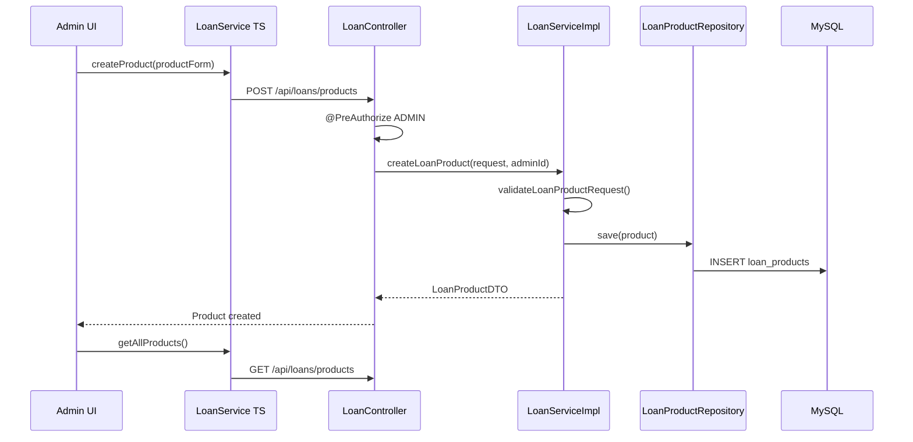
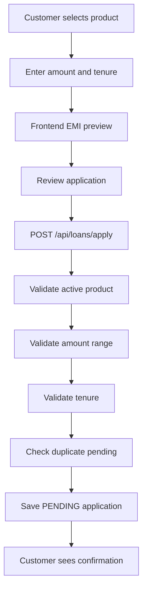
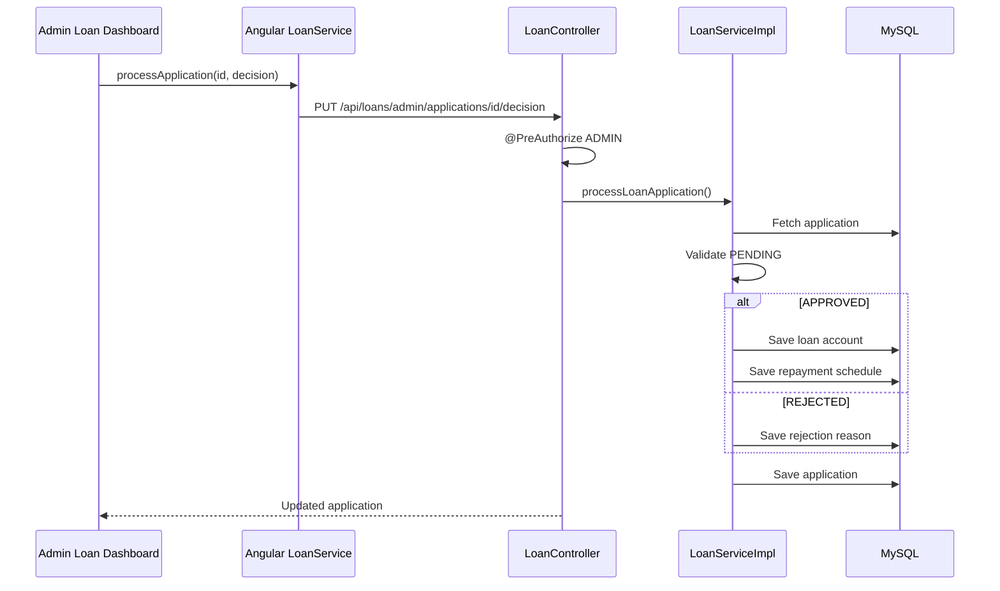
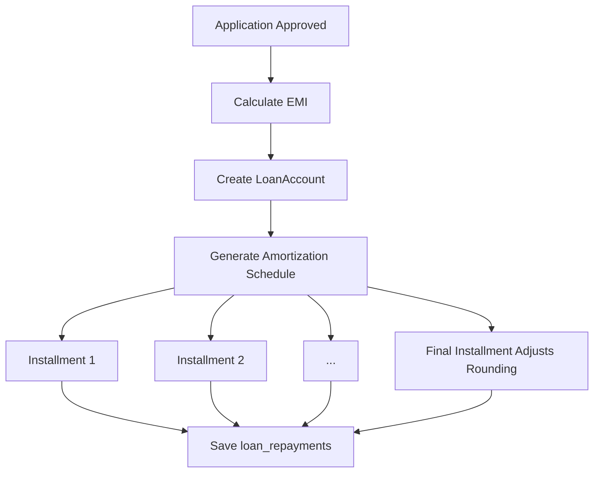
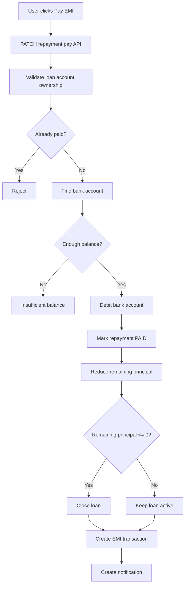
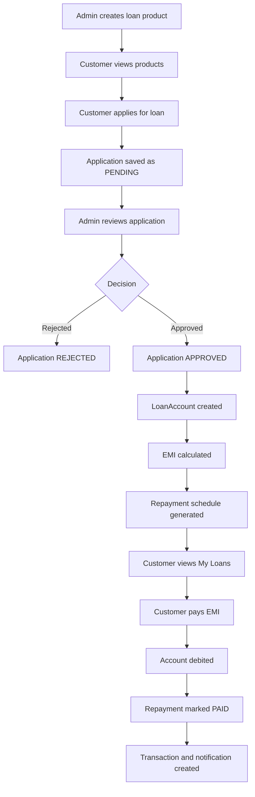

# Sprint 3 Work Explanation

This document explains the Day 22 to Day 27 implementation work for NeoBank360. It covers Loan Product Configuration, Loan Application, Admin Approval Workflow, EMI Calculation, Loan Account Generation, Repayment Tracking, and the related Angular UI.

The explanation is written in an interview-ready format and is based on the actual current implementation.

## Important Note

The original sprint plan mentions separate service names like `LoanProductService`, `LoanApplicationService`, `LoanDecisionService`, and `RepaymentScheduleService`.

In the current project, these responsibilities are implemented mainly inside:

```text
LoanServiceImpl
LoanController
LoanService
AdminLoansComponent
LoansApplyComponent
MyLoansComponent
```

So, in an interview, explain it like this:

> I implemented the loan module with a single cohesive `LoanServiceImpl` that handles product configuration, applications, approvals, loan account creation, EMI schedule generation, repayments, and loan dashboards. The service is split internally into clear sections for products, applications, admin decisions, loan accounts, repayments, and analytics.

Also note:

- Backend interest rate is stored as a decimal, for example `0.115` for 11.5%.
- Admin UI accepts percentage values and converts them before sending to backend.
- Current repayment list is returned as a list sorted by installment number. Angular UI handles presentation; backend pagination/filtering can be a future enhancement.

## Day 22: Loan Product Configuration

## Session 1: Backend Loan Product APIs

Loan products are represented by the `LoanProduct` JPA entity.

The entity is mapped using:

```java
@Entity
@Table(name = "loan_products")
```

Important fields:

- `id`
- `productName`
- `loanType`
- `description`
- `minAmount`
- `maxAmount`
- `interestRate`
- `allowedTenures`
- `minTenure`
- `maxTenure`
- `processingFee`
- `isActive`
- `createdBy`
- `createdAt`
- `updatedAt`

The loan type is an enum:

```java
public enum LoanType {
    PERSONAL, HOME, AUTO, EDUCATION, BUSINESS
}
```

This prevents invalid loan types from being saved.

The product creator is linked to admin user:

```java
@ManyToOne(fetch = FetchType.LAZY)
@JoinColumn(name = "created_by")
private User createdBy;
```

This allows the system to track which admin created a product.

The repository is:

```java
LoanProductRepository extends JpaRepository<LoanProduct, Long>
```

Important methods:

```java
findByIsActiveTrue()
findByLoanType(...)
findByIsActiveTrueAndLoanType(...)
```

These methods allow:

- fetching all active products
- filtering products by loan type
- listing products for customers

## Create Loan Product Logic

Loan product creation is implemented in:

```java
LoanServiceImpl.createLoanProduct()
```

The method is:

```java
@Transactional
@CacheEvict(value = "loanProducts", allEntries = true)
```

Why `@Transactional`?

Because product creation must save the full product consistently.

Why `@CacheEvict`?

Loan products are cached for fast reads. When admin creates/updates/deletes a product, old cached data must be cleared.

Flow:

```text
Receive LoanProductRequest
-> validate product fields
-> create LoanProduct entity
-> attach admin as createdBy
-> save product
-> return LoanProductDTO
```

Validation is done in:

```java
validateLoanProductRequest()
```

Important checks:

```java
maxAmount > minAmount
maxTenure >= minTenure
allowedTenures is not empty
allowedTenures are valid numbers
allowedTenures fall inside minTenure and maxTenure
```

Example:

If min tenure is 12 and max tenure is 48, allowed tenures must be between 12 and 48.

If admin enters:

```text
6,12,60
```

then validation fails because 6 and 60 are outside the allowed range.

## Loan Product APIs

Controller:

```java
LoanController
```

Create product:

```http
POST /api/loans/products
```

Protected with:

```java
@PreAuthorize("hasRole('ADMIN')")
```

Only admins can create products.

Get all products:

```http
GET /api/loans/products
```

Get active products:

```http
GET /api/loans/products/active
```

Get by ID:

```http
GET /api/loans/products/{id}
```

Update:

```http
PUT /api/loans/products/{id}
```

Delete is soft delete:

```http
DELETE /api/loans/products/{id}
```

Soft delete means:

```java
product.setIsActive(false);
```

The product is not physically removed. It becomes inactive.

## Session 2: Frontend Admin Product Configuration UI

The admin loan product UI is implemented in:

```text
AdminLoansComponent
```

Service used:

```text
LoanService
```

Product APIs in Angular:

```ts
getAllProducts()
getActiveProducts()
getProductById()
createProduct()
updateProduct()
deleteProduct()
```

Admin product form uses:

```ts
productForm: LoanProductRequest
```

Important fields:

- `productName`
- `loanType`
- `description`
- `minAmount`
- `maxAmount`
- `interestRate`
- `allowedTenures`
- `minTenure`
- `maxTenure`
- `processingFee`

Frontend validation happens inside:

```ts
saveProduct()
```

Important checks:

```ts
if (!productName || !allowedTenures) {
  formError = 'Please fill all required fields';
}

if (minAmount <= 0 || maxAmount <= minAmount) {
  formError = 'Maximum amount must be greater than minimum amount';
}

if (minTenure <= 0 || maxTenure < minTenure) {
  formError = 'Maximum tenure must be greater than or equal to minimum tenure';
}
```

Allowed tenures are parsed from comma input:

```ts
allowedTenures.split(',').map(...)
```

Then the UI checks whether every tenure is inside min/max range.

The admin enters interest rate as percentage, for example:

```text
11.5
```

Before sending to backend, Angular converts it:

```ts
interestRate: this.productForm.interestRate / 100
```

So backend receives:

```text
0.115
```

This is why backend EMI calculations work using decimal rates.

## Loan Product Flow



## Day 23: Loan Application Engine

## Session 1: Backend Loan Application

Loan applications are represented by:

```java
LoanApplication
```

Important fields:

- `applicationNumber`
- `user`
- `loanProduct`
- `requestedAmount`
- `requestedTenure`
- `status`
- `appliedAt`
- `processedAt`
- `processedBy`
- `adminRemarks`
- `rejectionReason`
- `income`
- `employerName`
- `designation`
- `monthlyIncome`
- `existingEmis`

Status enum:

```java
PENDING, APPROVED, REJECTED, DISBURSED
```

Application submission is handled by:

```java
LoanServiceImpl.applyForLoan()
```

Endpoint:

```http
POST /api/loans/apply
```

The controller extracts the logged-in user:

```java
Long userId = securityUtils.getCurrentUser().getId();
```

This is important because the frontend does not send userId. Backend gets it from JWT.

Application flow:

```text
Find user
-> find loan product
-> validate product is active
-> check duplicate pending application
-> validate amount within min/max
-> validate tenure in allowed tenures
-> generate application number
-> save loan application as PENDING
-> return LoanApplicationDTO
```

Duplicate pending check:

```java
loanApplicationRepository.findPendingApplicationByUserId(userId)
```

If user already has a pending application:

```java
throw new BadRequestException("You already have a pending loan application...")
```

Amount validation:

```java
requestedAmount >= minAmount
requestedAmount <= maxAmount
```

Tenure validation:

```java
allowedTenures.contains(requestedTenure)
```

Allowed tenures are parsed from comma-separated string:

```java
parseTenures(product.getAllowedTenures())
```

Example:

```text
"12,24,36"
```

becomes:

```text
[12, 24, 36]
```

## Session 2: Frontend Customer Application UI

Customer loan application UI is implemented in:

```text
LoansApplyComponent
```

The UI uses a three-step flow:

```text
Step 1: Select Product
Step 2: Enter Details
Step 3: Review and Submit
```

Products are loaded using:

```ts
loanService.getActiveProducts()
```

Step 1:

- user selects loan product
- product card shows interest rate, amount range, and tenure range

Step 2:

- user enters loan amount
- user selects tenure
- user enters income/employment details
- EMI preview is calculated

Step 3:

- user reviews product, amount, tenure, interest rate, EMI
- user accepts terms
- user submits application

Submit calls:

```ts
loanService.applyForLoan(request)
```

which sends:

```http
POST /api/loans/apply
```

## Loan Application Flow



## Day 24: Administrative Approval Workflow

## Session 1: Backend Approval Workflow

Admin decision is handled by:

```java
LoanServiceImpl.processLoanApplication()
```

Endpoint:

```http
PUT /api/loans/admin/applications/{id}/decision
```

Also supported:

```http
PUT /api/loans/{id}/decision
```

Protected with:

```java
@PreAuthorize("hasRole('ADMIN')")
```

So customer access returns forbidden.

Workflow:

```text
Find application
-> validate application is still PENDING
-> find admin user
-> set processedBy
-> set processedAt
-> if REJECTED: set status REJECTED, remarks, reason
-> if APPROVED: set status APPROVED, remarks, create loan account and repayment schedule
-> save application
-> return LoanApplicationDTO
```

Important status validation:

```java
if (application.getStatus() != ApplicationStatus.PENDING) {
    throw new BadRequestException("This application has already been processed");
}
```

This prevents double approval or double rejection.

On rejection:

```java
application.setStatus(ApplicationStatus.REJECTED);
application.setRejectionReason(decision.getRejectionReason());
application.setAdminRemarks(decision.getRemarks());
```

On approval:

```java
application.setStatus(ApplicationStatus.APPROVED);
createLoanAccount(application);
```

The method is transactional:

```java
@Transactional
```

Why?

Because approval must update application status, create loan account, and generate repayment schedule in one consistent operation.

If schedule generation fails, the application should not be partially approved.

## Admin Application APIs

All applications:

```http
GET /api/loans/admin/applications
```

Pending:

```http
GET /api/loans/admin/applications/pending
```

Approved:

```http
GET /api/loans/admin/applications/approved
```

Rejected:

```http
GET /api/loans/admin/applications/rejected
```

## Session 2: Frontend Admin Decision Dashboard

Admin decision UI is implemented in:

```text
AdminLoansComponent
```

It loads applications using:

```ts
getPendingApplications()
getApprovedApplications()
getRejectedApplications()
```

The UI has application tabs:

```ts
appTab = 'pending';
```

Applications are displayed as cards/tables with:

- applicant name
- email
- loan product
- requested amount
- tenure
- status
- application number

Admin can open:

```ts
openApplicationReview(app)
```

or decision modal:

```ts
openDecisionModal(app, 'APPROVED')
openDecisionModal(app, 'REJECTED')
```

Decision submit:

```ts
submitDecision()
```

This builds:

```ts
const decision: LoanDecisionRequest = {
  decision: this.decisionType,
  remarks: this.decisionRemarks,
  rejectionReason: this.rejectionReason
};
```

Then calls:

```ts
loanService.processApplication(applicationId, decision)
```

After success:

```ts
this.loadApplications();
this.loadDashboard();
this.closeDecisionModal();
```

So the pending list and dashboard stats refresh immediately.

## Approval Flow Diagram



## Day 25: EMI Calculation And Loan Account Creation

## Session 1: EMI Calculator And Loan Account

EMI calculation is implemented in:

```java
EmiCalculatorUtil
```

Main method:

```java
calculateEmi(BigDecimal principal, BigDecimal annualRate, int tenureInMonths)
```

The formula is:

```text
EMI = P * r * (1 + r)^n / ((1 + r)^n - 1)
```

Where:

- `P` = principal loan amount
- `r` = monthly interest rate
- `n` = tenure in months

In this project, backend annual rate is decimal:

```text
0.115 means 11.5%
```

Monthly rate:

```java
annualRate.divide(BigDecimal.valueOf(12), 6, RoundingMode.HALF_UP)
```

So:

```text
monthlyRate = annualRate / 12
```

The code uses `BigDecimal`, not `double`.

Why?

Financial calculations need decimal precision. `double` can introduce floating point errors.

Rounding:

```java
SCALE = 2
ROUNDING_MODE = HALF_UP
```

So EMI is rounded like normal banking currency values.

Zero-interest case:

```java
if annualRate == 0:
    EMI = principal / tenure
```

Input validation:

- principal cannot be null
- interest rate cannot be null
- tenure must be greater than 0
- principal must be positive
- interest rate cannot be negative

## Loan Account Creation

When admin approves a loan:

```java
createLoanAccount(application)
```

is called.

It calculates:

```java
emi
totalInterest
totalAmount
```

Then creates:

```java
LoanAccount
```

Important fields:

- `loanAccountNumber`
- `loanApplication`
- `user`
- `loanProduct`
- `principalAmount`
- `interestRate`
- `tenureMonths`
- `emiAmount`
- `totalInterest`
- `totalAmount`
- `disbursedAmount`
- `disbursedDate`
- `firstEmiDate`
- `lastEmiDate`
- `remainingPrincipal`
- `status`

Loan account number is generated as:

```java
"LN" + System.currentTimeMillis()
```

The loan status is set to:

```java
LoanStatus.ACTIVE
```

## Session 2: Amortization Schedule Generation

Repayment schedule generation is implemented in:

```java
generateRepaymentSchedule()
```

It uses:

```java
EmiCalculatorUtil.generateAmortizationSchedule()
```

For each installment:

```text
interestComponent = remainingBalance * monthlyRate
principalComponent = EMI - interestComponent
remainingBalance = remainingBalance - principalComponent
```

The final installment absorbs rounding difference:

```java
if (i == tenureInMonths - 1) {
    principalComponent = remainingBalance;
    emi = principalComponent + interestComponent;
}
```

Why?

Because rounding every month can leave a few paisa/rupees residual. The final EMI adjusts that so the remaining balance becomes exactly zero.

Each repayment record stores:

- installment number
- due date
- EMI amount
- principal component
- interest component
- remaining principal
- status PENDING
- paid amount
- penalty amount

All repayment records are saved using:

```java
loanRepaymentRepository.saveAll(repayments)
```

## EMI And Schedule Diagram



## Day 26: Repayment Tracking API

## Session 1: Get Repayment Schedule

Repayments are represented by:

```java
LoanRepayment
```

Important fields:

- `loanAccount`
- `installmentNumber`
- `dueDate`
- `emiAmount`
- `principalComponent`
- `interestComponent`
- `remainingPrincipal`
- `status`
- `paidAmount`
- `paidDate`
- `paymentReference`
- `penaltyAmount`

The repayment schedule API is:

```http
GET /api/loans/{loanAccountId}/repayments
```

Controller:

```java
LoanController.getRepayments()
```

Service:

```java
LoanServiceImpl.getRepaymentsByLoanAccount()
```

Flow:

```text
Find loan account
-> validate access
-> fetch repayments by loanAccountId
-> sort by installment number
-> map to LoanRepaymentDTO
-> return list
```

Access validation is done by:

```java
assertLoanAccountAccess()
```

Logic:

```text
If requester is ADMIN -> allow
If requester is USER and owns loan account -> allow
Otherwise -> reject
```

This prevents one customer from seeing another customer's repayment schedule.

Current repository method:

```java
findByLoanAccountIdOrderByInstallmentNumberAsc()
```

So repayment schedule is sorted by installment number.

## Session 2: Payment Status Logic

Overdue logic exists in:

```java
checkAndUpdateOverdueRepayments()
```

It:

```text
finds repayments where status = PENDING and dueDate < today
marks them OVERDUE
adds penalty
saves repayment
```

EMI payment endpoint:

```http
PATCH /api/loans/{loanAccountId}/repayments/{repaymentId}/pay
```

Service method:

```java
payRepayment()
```

Payment flow:

```text
Find repayment
-> validate repayment belongs to loan account
-> validate loan account access
-> reject if already PAID
-> find user's bank account
-> calculate payable amount = EMI + penalty
-> check sufficient bank balance
-> debit bank account
-> mark repayment PAID
-> set paid amount
-> set paid date
-> set payment reference
-> reduce loan remaining principal
-> close loan if principal becomes zero
-> save repayment
-> save loan account
-> create debit transaction
-> create notification
-> return LoanRepaymentDTO
```

EMI payment creates a normal transaction with category:

```java
PaymentCategoryUtil.EMI_PAYMENT
```

This connects EMI payments to:

- transaction history
- budget analytics
- spending overview
- recent transactions

## EMI Payment Flow



## Day 27: Repayment Schedule UI

## Session 1: Active Loan Accounts View

Customer loan account and repayment UI is implemented in:

```text
MyLoansComponent
```

Angular service:

```text
LoanService
```

Important APIs:

```ts
getMyAccounts()
getMyApplications()
getMyRepayments()
getRepayments(loanAccountId)
payRepayment(loanAccountId, repaymentId)
getUserDashboard()
```

The UI shows:

- active loan accounts
- application status
- upcoming EMIs
- loan dashboard summary

Loan account data includes:

- loan account number
- product name
- principal amount
- EMI amount
- tenure
- disbursed date
- remaining principal
- paid installments
- remaining installments

## Session 2: Repayment Schedule Detail View

The repayment schedule UI shows:

- installment number
- due date
- EMI amount
- principal component
- interest component
- status
- payment action

Status values:

```text
PENDING
PAID
OVERDUE
```

The UI uses status-based styling:

```text
PENDING -> amber
PAID -> green
OVERDUE -> red
```

This makes it easy for the user to identify payment state quickly.

When the user pays an EMI, the frontend calls:

```ts
loanService.payRepayment(loanAccountId, repaymentId)
```

which sends:

```http
PATCH /api/loans/{loanAccountId}/repayments/{repaymentId}/pay
```

After successful payment, the UI reloads:

- loan accounts
- repayment schedule
- dashboard values
- upcoming EMIs

## Frontend Loan Service

The Angular `LoanService` centralizes all loan API calls.

Product APIs:

```ts
getAllProducts()
getActiveProducts()
createProduct()
updateProduct()
deleteProduct()
```

Application APIs:

```ts
applyForLoan()
getMyApplications()
getAllApplications()
getPendingApplications()
processApplication()
```

Loan account APIs:

```ts
getMyAccounts()
getAccountById()
```

Repayment APIs:

```ts
getRepayments()
getMyRepayments()
payRepayment()
```

Frontend EMI preview:

```ts
calculateEmi(principal, annualRate, tenureMonths)
```

This gives users instant EMI preview before submitting.

The backend still performs the official EMI calculation after admin approval.

## Complete Sprint 3 Flow



## Backend And Frontend Connection

### Admin Product Creation

```text
AdminLoansComponent.saveProduct()
-> LoanService.createProduct()
-> POST /api/loans/products
-> LoanController.createLoanProduct()
-> LoanServiceImpl.createLoanProduct()
-> LoanProductRepository.save()
-> MySQL loan_products
-> return LoanProductDTO
-> Angular refreshes product list
```

### Customer Loan Application

```text
LoansApplyComponent.submitApplication()
-> LoanService.applyForLoan()
-> POST /api/loans/apply
-> LoanController.applyForLoan()
-> LoanServiceImpl.applyForLoan()
-> validate product, amount, tenure, duplicate pending
-> save LoanApplication
-> return LoanApplicationDTO
```

### Admin Approval

```text
AdminLoansComponent.submitDecision()
-> LoanService.processApplication()
-> PUT /api/loans/admin/applications/{id}/decision
-> LoanServiceImpl.processLoanApplication()
-> if approved, create LoanAccount and LoanRepayments
-> return updated LoanApplicationDTO
```

### Customer EMI Payment

```text
MyLoansComponent pay action
-> LoanService.payRepayment()
-> PATCH /api/loans/{loanAccountId}/repayments/{repaymentId}/pay
-> LoanServiceImpl.payRepayment()
-> debit account
-> mark repayment paid
-> reduce remaining principal
-> create transaction
-> create notification
-> return LoanRepaymentDTO
```

## Why These Technical Decisions Were Used

### Admin-Only Product Configuration

Loan product settings control real financial rules such as amount ranges, interest rates, and tenures. Only admins should configure them.

### Soft Delete For Products

Products are marked inactive instead of physically deleted.

Why?

Existing loan applications and loan accounts may still reference old products. Soft delete preserves historical integrity.

### Cached Loan Products

Loan products are read frequently by users and admins.

The backend uses:

```java
@Cacheable(value = "loanProducts")
```

and clears cache on create/update/delete:

```java
@CacheEvict(value = "loanProducts", allEntries = true)
```

This improves product loading speed while keeping data fresh.

### BigDecimal For EMI

Financial calculations cannot rely on floating point precision.

`BigDecimal` gives controlled precision and rounding.

### Final Installment Rounding Adjustment

Monthly rounding can create a small residual balance.

The final installment absorbs this residual so:

```text
sum of principal components = original principal
remaining balance = 0
```

### Transactional Approval

Loan approval updates:

- application status
- loan account
- repayment schedule

All must succeed or fail together. That is why approval is transactional.

### Repayment Records Are Immutable

There are no normal update/delete APIs for repayment rows.

Why?

Repayment schedules are financial records. They should not be arbitrarily edited after generation.

### EMI Payment Creates Transaction

EMI payment is not just a loan update. It also affects bank account balance and transaction history.

This makes the loan module connected to the rest of banking.

## Business Impact

### Loan Product Configuration

Admins can define different banking products like Personal Loan, Home Loan, Auto Loan, Education Loan, and Business Loan.

### Loan Application

Customers can apply digitally without visiting a branch.

### Admin Approval Workflow

Bank officers can approve/reject loans from a dashboard.

### Automatic EMI Generation

This saves administrative time because the system automatically creates the full repayment schedule after approval.

### EMI Tracking

Customers can see what is due, paid, and overdue.

### EMI Payment

Customers can pay installments from their account, and the system updates loan balance, transaction history, and notifications.

## Interview Explanation

You can say:

> In Sprint 3, I implemented the Loan Management System. Admins can configure loan products with min/max amount, interest rate, loan type, and allowed tenures. Customers can browse products and apply for loans. The backend validates amount range, tenure, active product status, and duplicate pending applications. Admins can approve or reject applications. When approved, the system automatically creates a loan account, calculates EMI using the reducing balance formula, and generates a full amortization repayment schedule.

For EMI:

> I used BigDecimal for EMI calculation because banking calculations need decimal precision. The formula uses reducing balance logic where interest is calculated every month on the remaining principal. The final installment adjusts rounding residual so the loan closes exactly at zero remaining principal.

For approval:

> Loan approval is transactional because multiple records are created together: application status, loan account, and repayment schedule. If any step fails, the whole approval should roll back.

For repayment:

> EMI payment validates ownership, checks bank balance, debits the account, marks the repayment paid, reduces remaining principal, creates a debit transaction, and sends a notification. This connects the loan module with accounts, transactions, budgeting, and notifications.

## Interview Questions To Practice

### Day 22: Loan Product Configuration

1. What is a loan product?
2. Why should only admins create loan products?
3. What fields are stored in `LoanProduct`?
4. Why use enum for loan type?
5. Why validate max amount greater than min amount?
6. Why validate allowed tenures?
7. Why is product delete implemented as soft delete?
8. Why are loan products cached?
9. What does `@CacheEvict` do?
10. How does the admin UI convert percentage interest into decimal interest?

### Day 23: Loan Application

1. Explain the loan application flow.
2. How does backend know which user is applying?
3. Why should userId not come from frontend body?
4. How do you validate requested amount?
5. How do you validate selected tenure?
6. How do you prevent duplicate pending applications?
7. What status is assigned to a new application?
8. Why is application number generated?
9. What is the role of `LoanApplicationDTO`?
10. How does frontend show EMI preview before submission?

### Day 24: Admin Approval

1. Why is approval endpoint admin-only?
2. What happens when admin rejects a loan?
3. What happens when admin approves a loan?
4. Why should an already processed application not be processed again?
5. Why is approval transactional?
6. What records are created after approval?
7. How does admin UI refresh after decision?
8. Difference between PENDING, APPROVED, and REJECTED?
9. Why store admin remarks?
10. Why store processedBy and processedAt?

### Day 25: EMI And Loan Account

1. Explain the EMI formula.
2. Why use BigDecimal instead of double?
3. What is monthly interest rate?
4. How is total interest calculated?
5. What fields are stored in LoanAccount?
6. What is amortization?
7. How do you calculate principal and interest component?
8. Why does final installment need rounding adjustment?
9. How is first EMI date calculated?
10. Why is remaining principal stored?

### Day 26: Repayment Tracking

1. What is a LoanRepayment record?
2. How do you fetch repayment schedule?
3. How do you validate repayment schedule ownership?
4. When does a repayment become overdue?
5. What happens when EMI is paid?
6. Why do you check bank balance before EMI payment?
7. Why does EMI payment create a transaction?
8. How does remaining principal reduce?
9. When is loan status changed to CLOSED?
10. Why should repayment rows not be deleted?

### Day 27: Repayment UI

1. What does My Loans page display?
2. What does repayment schedule show?
3. How are statuses visually represented?
4. How does frontend call EMI payment API?
5. What should refresh after EMI payment?
6. How does user identify upcoming EMIs?
7. Why is a repayment table useful?
8. How does Angular LoanService simplify API calls?
9. Difference between application list and loan account list?
10. How does EMI payment affect user dashboard?

## Best Answer To Remember

> Sprint 3 transformed NeoBank360 from simple banking into a lending platform. The loan workflow starts with admin product configuration, moves to customer application, then admin approval, and finally automatic loan account and EMI schedule generation. The strongest part is that approval automatically creates financial records using EMI and amortization logic, so the system behaves like a real bank loan system instead of just storing application forms.
